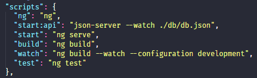
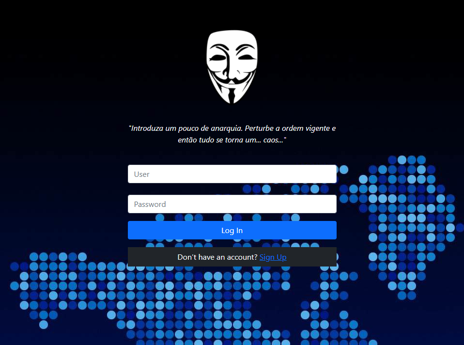
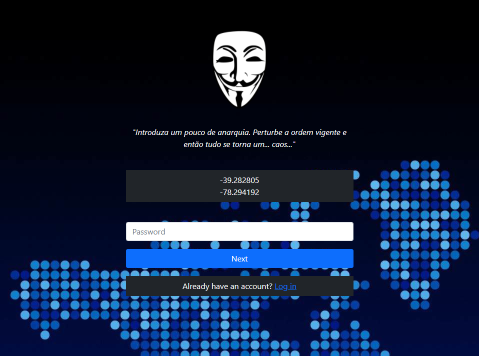
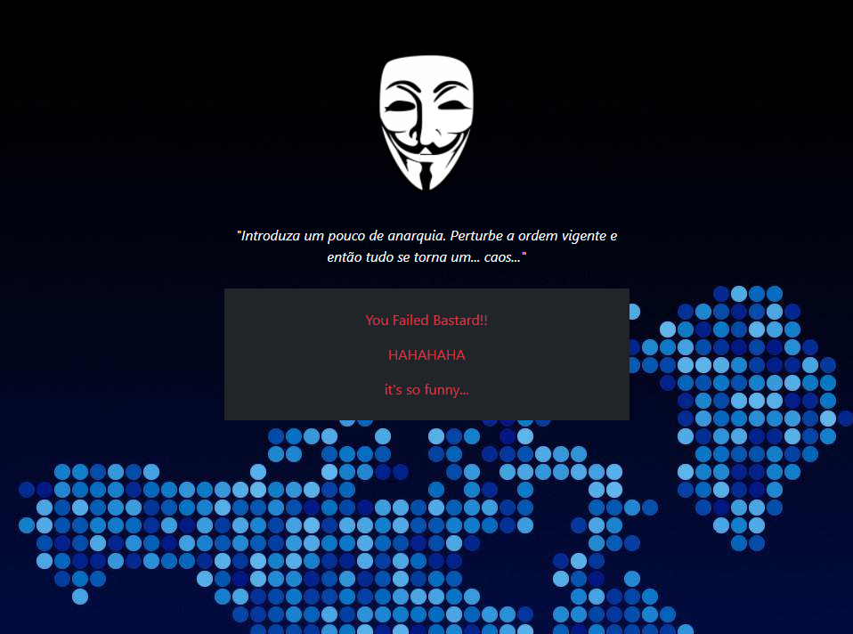

# Alurapic

---

This project was generated with [Angular CLI](https://github.com/angular/angular-cli) version 13.2.4.

## Development server

Run `ng serve` for a dev server. Navigate to `http://localhost:4200/`. The app will automatically reload if you change any of the source files.

## Code scaffolding

Run `ng generate component component-name` to generate a new component. You can also use `ng generate directive|pipe|service|class|guard|interface|enum|module`.

## Build

Run `ng build` to build the project. The build artifacts will be stored in the `dist/` directory.

## Running unit tests

Run `ng test` to execute the unit tests via [Karma](https://karma-runner.github.io).

## Running end-to-end tests

Run `ng e2e` to execute the end-to-end tests via a platform of your choice. To use this command, you need to first add a package that implements end-to-end testing capabilities.

## Further help

To get more help on the Angular CLI use `ng help` or go check out the [Angular CLI Overview and Command Reference](https://angular.io/cli) page.

---

# Installation

Before installing, download and install the required dependencies:

- Git 2.35.1 or higher
- Node.js 16.14.0 or higher.

This is a Typescript module managed through the npm registry.

Installation is done using the git to clone the repository:

```shell
$ git clone https://github.com/donatocardoso/studying-angular.git
```

In the repository folder run:

```shell
$ npm install
```

```shell
$ yarn
```

# Quick Start

The quickest way to get started the project is to see in package.json the commands available for use:



Install dependencies:

```shell
$ npm install
```

```shell
$ yarn
```

Start the server api:

```shell
$ npm run start:api
```

```shell
$ yarn start:api
```

Start the server:

```shell
$ npm start
```

```shell
$ yarn start
```

Open in your browser:

```
http://localhost:4200/login
```

# About

The site has security encryption and security policies, in case you don't have an account, this will be a test for you.

First, you must solve challenges to get a secure password to access the software.

Below you will see an example:

<p>
  <div style="margin-bottom: 25px;">
    <b>Route: /login</b>
    
    <i>Here you will authenticate in the software</i>
  </div>
<p>

<p>
  <div>
    <b>Route: /login/signup</b>
    
    <i>Here you will take a test, if you have logical intelligence you will pass</i>
  </div>
</p>

<p>
  <div>
    <b>Route: /login/signup</b>
    
    <i>Here you have passed the test and must register a username. Note: Save the test answer, because it's your password</i>
  </div>
</p>

<p>
  <div>
    <b>Route: /login/blocked</b>
    
    <i>Here you failed the test miserably and must be punished for this boldness.</i>
  </div>
</p>

With the registered user and password, you can authenticate in the software and take advantage of its technologies and functionalities.

But remember, with great power there are always great responsibilities...

<p>...</p>
<p>...</p>

or not HAHAHAHAHAH
